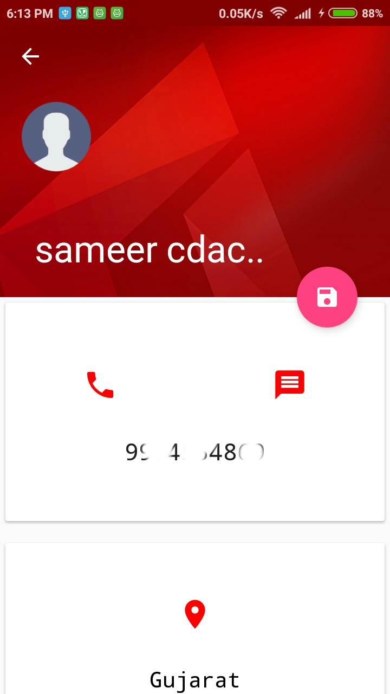
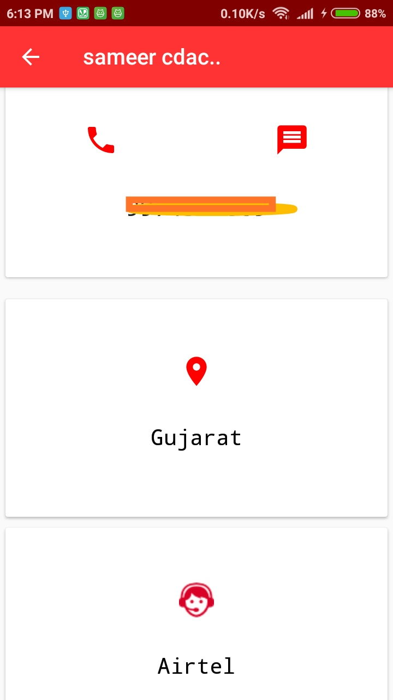
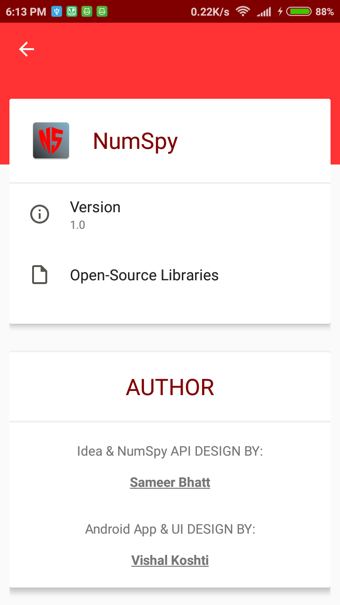

# NumSpy: Android Application 

<b>NumSpy: Public API:</b>
 NumSpy Public API which provide details of any mobile number in india. 
Created By: [Sameer Bhatt](https://github.com/bhattsameer)
More Information : [NumSpy-API](https://github.com/bhattsameer/numspy-api)

<b>NumSpy: Android Application:</b>
 It is an Android appliaction by which user can search details of any mobile number in India for free without any signup/login.

 

 

<b>Official NumSpy Project:</b> [NumSpy](https://bhattsameer.github.io/numspy)

# Screenshots

 

  

 

  

 

  

# Deployment

<b> We have not uploaded this application to any app store yet, but we will soon upload it. However, you are free to download ,  compile and run this application.</b>

# Credits

[Sameer Bhatt](https://github.com/bhattsameer)
For an awesome API and Suggestion for the App

# License

<b> This project is under MIT License.</b>

